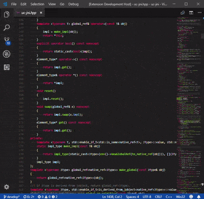
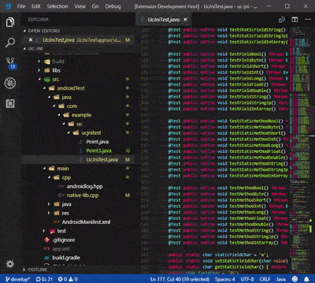
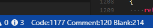

# VScode Counter

VS Code extension: counts blank lines, comment lines, and physical lines of source code in many programming languages.

* [github](https://github.com/uctakeoff/vscode-counter)
* [Marketplace](https://marketplace.visualstudio.com/items?itemName=uctakeoff.vscode-counter)

## Features

- Count the code lines of source code in workspace or directory.
- Count the code lines of the current file in real time.

## Usage

### Count in workspace

* Open the command palette and select  `VSCode Counter: Count lines in workspace`.

    

### Count in any directory

* Open Explorer and right click on the folder.
* Select `Count lines in directory`.

    

### Real-time counter

* Open the command palette and select  `VSCode Counter: Toggle Real-time Counter Visibility`.

    

## Extension Settings

* `VSCodeCounter.showInStatusBar`: Whether to show the count result of the current file on the status bar in real time.
* `VSCodeCounter.useGitignore`: Whether to use '.gitignore' files for excluding files.
* `VSCodeCounter.useFilesExclude`: Whether to use setting 'files.exclude' for excluding files.
* `VSCodeCounter.printNumberWithCommas`: Whether to print a number with commas as thousands separators.(except for CSV)
* `VSCodeCounter.ignoreUnsupportedFile`: Ignore unsupported files.
* `VSCodeCounter.endOfLine`: A new line character to be used in the output file.
* `VSCodeCounter.include`: Configure glob patterns for including files and folders.
* `VSCodeCounter.exclude`: Configure glob patterns for excluding files and folders.
* `VSCodeCounter.outputDirectory`: Directory path for outputting results.
* `VSCodeCounter.outputAsText`: Whether to output the result as a text file.
* `VSCodeCounter.outputAsCSV`: Whether to output the result as a CSV file.
* `VSCodeCounter.outputAsMarkdown`: Whether to output the result as a Markdown file.
* `VSCodeCounter.outputPreviewType`: Type of output file to preview after counting. Choose from `text`, `csv`, `markdown` or `none`.
* `VSCodeCounter.blockComment`: Define patterns indicating the beginning and end of the block document(here document).

**Enjoy!**
